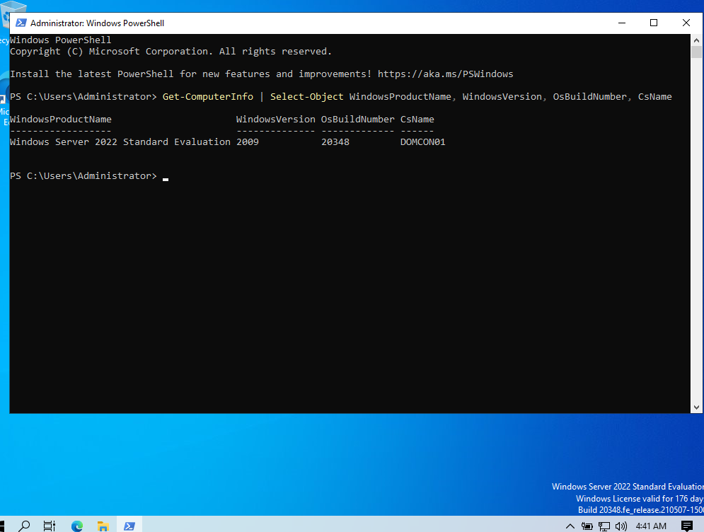
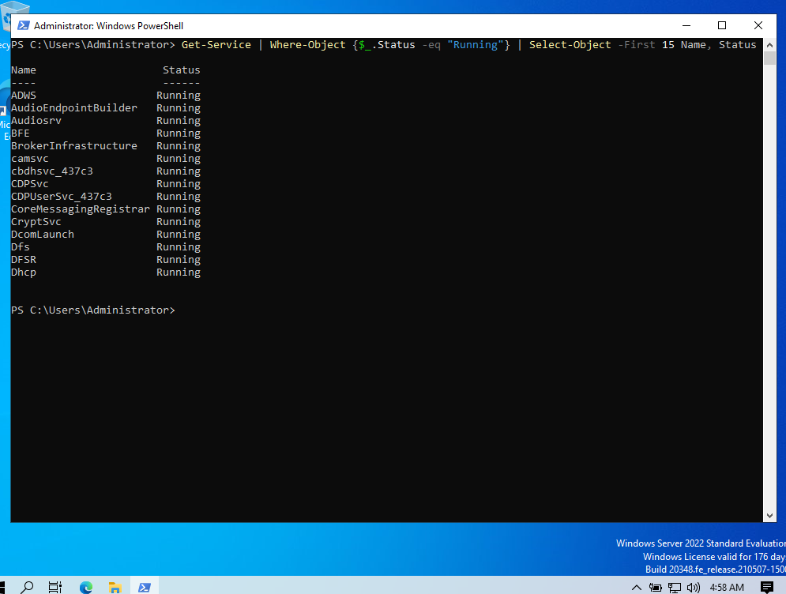
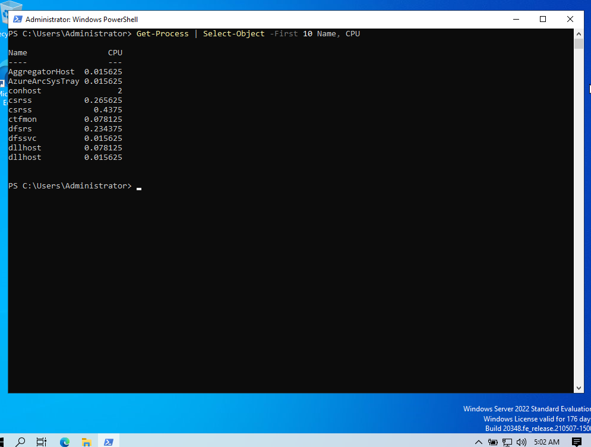
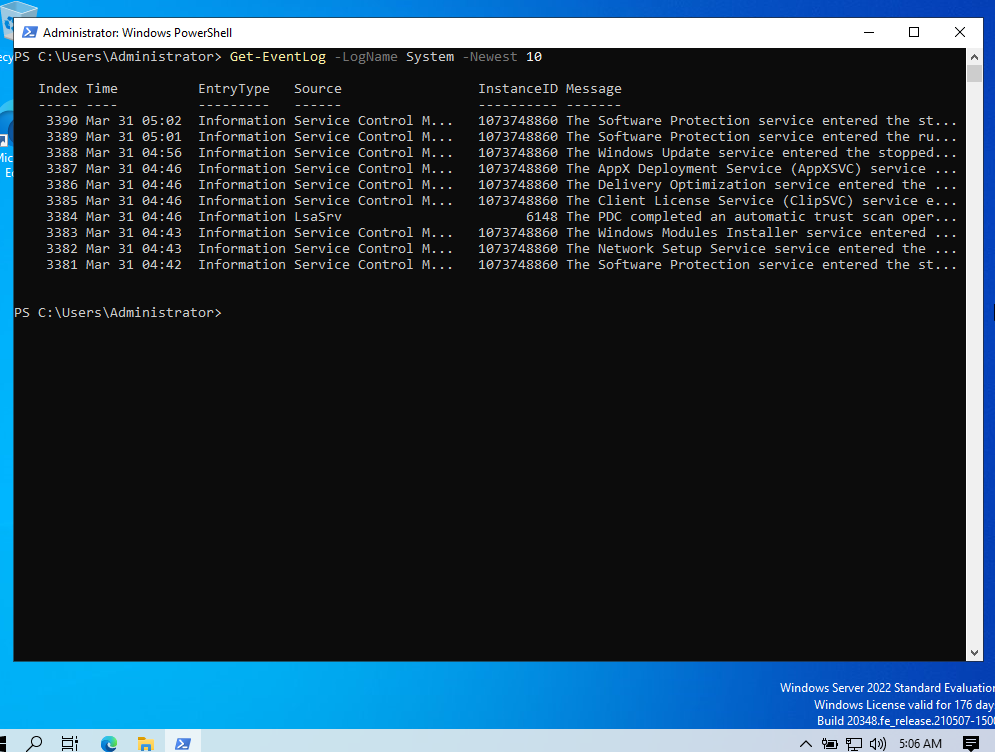
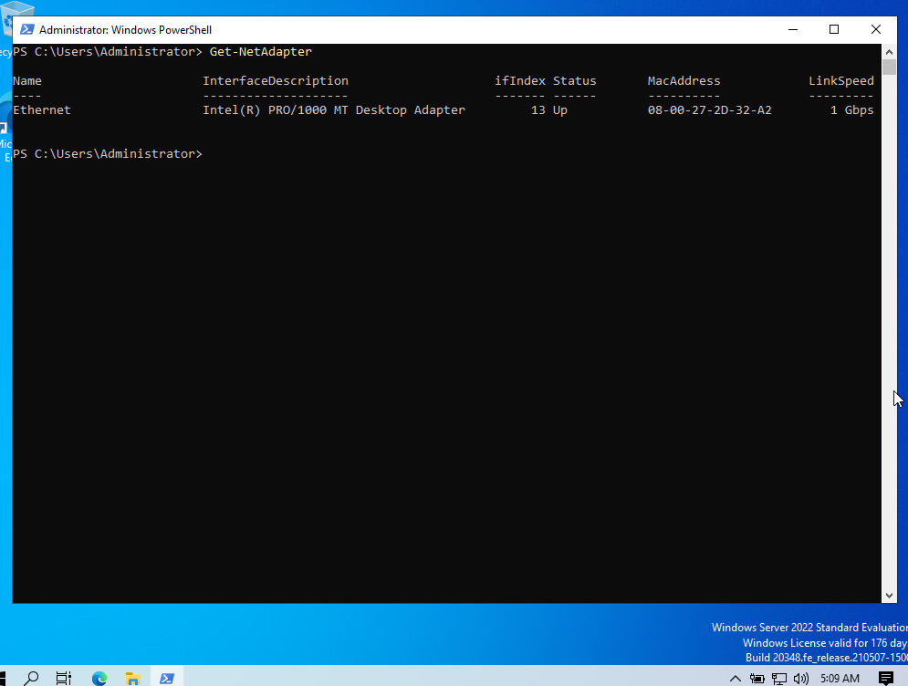
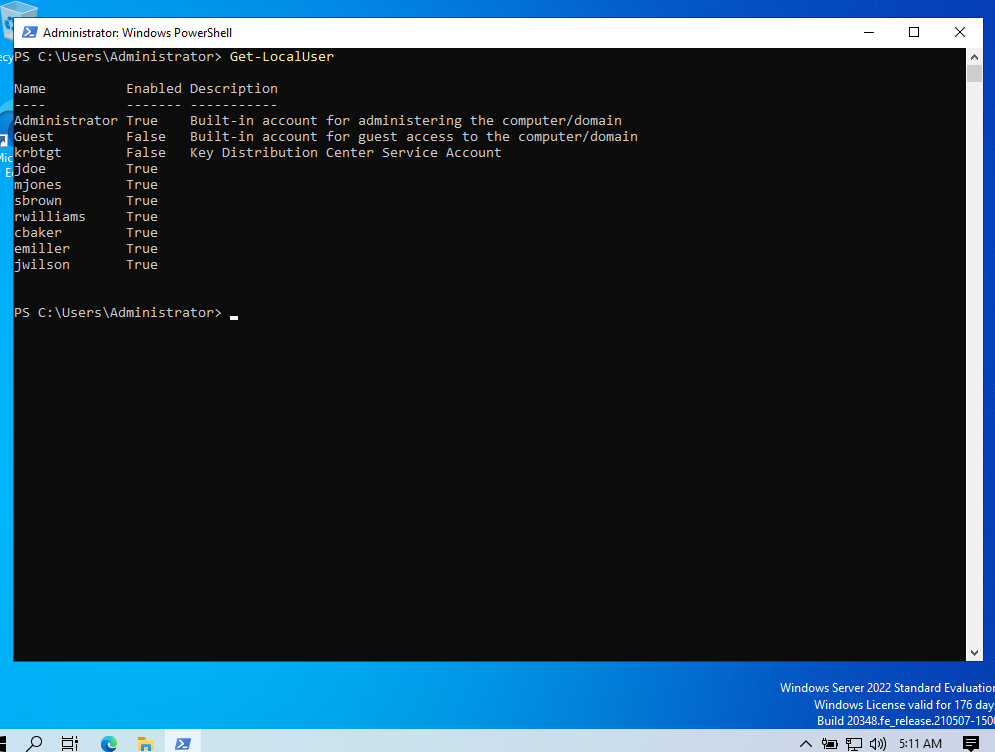
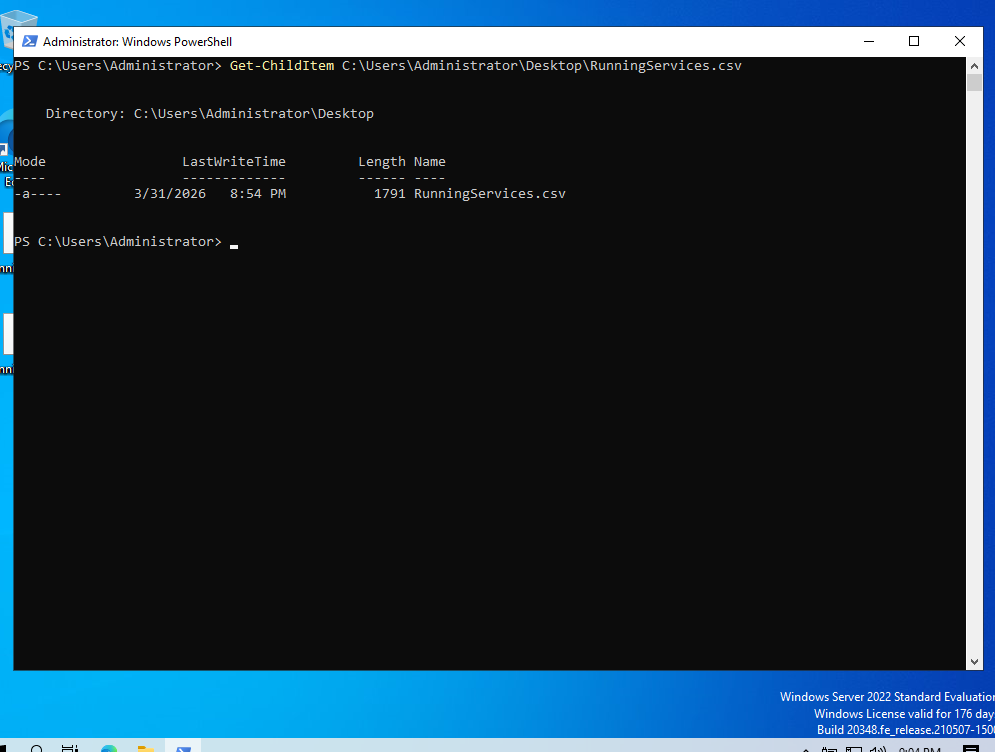
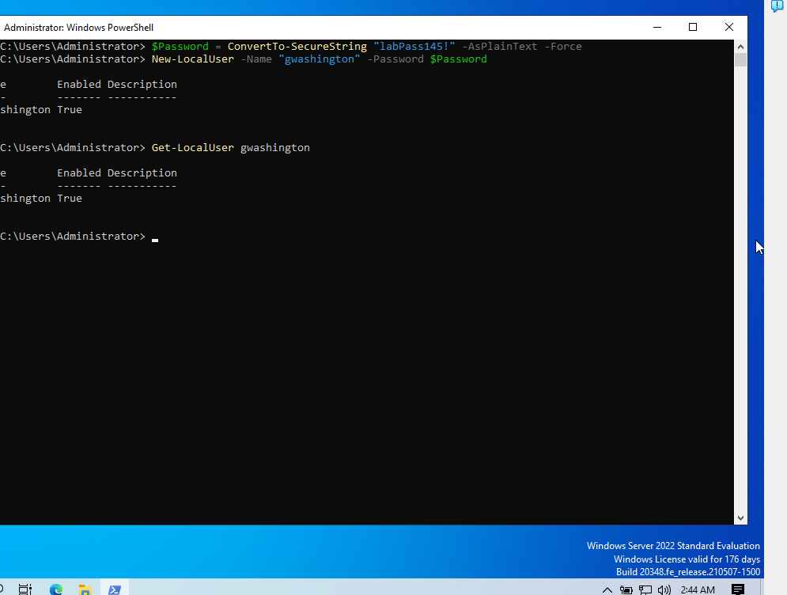

**PowerShell Administration Lab**

I built this hands-on PowerShell lab inside a Windows Server 2022 virtual machine running in Oracle VM VirtualBox to practice practical command-line administration.

This shows system visibility, service review, process monitoring, event log inspection, local user review, and basic administrative automation using PowerShell.

Objective

The objective of this lab was to use PowerShell for common administrative tasks that support Windows troubleshooting, account visibility, service review, and simple automation in a Windows environment.

System Information

I used PowerShell to review operating system and host information directly from the command line.

Running Services

I reviewed active Windows services to confirm service status and visibility through PowerShell.

Process Review

I reviewed active processes to observe system activity and CPU usage.

Event Log Review

I reviewed recent system log entries to practice event visibility through PowerShell.

Network Adapter Review

I used PowerShell to verify adapter status, interface details, and link speed.

Local User Review

I reviewed local user accounts to confirm account visibility and account status.

Export Running Services to CSV

I exported running services to a CSV file and verified the file was created successfully on the desktop.

Local User Creation

I created a local test user in PowerShell and verified the account afterward.

Summary

This lab demonstrated practical PowerShell administration in Windows Server 2022, including system review, service visibility, process inspection, event log review, network adapter visibility, local user administration, and simple automation through exported reporting and account creation.

Navigation

[`Back to GitHub Profile`](https://github.com/cbueker-it)
